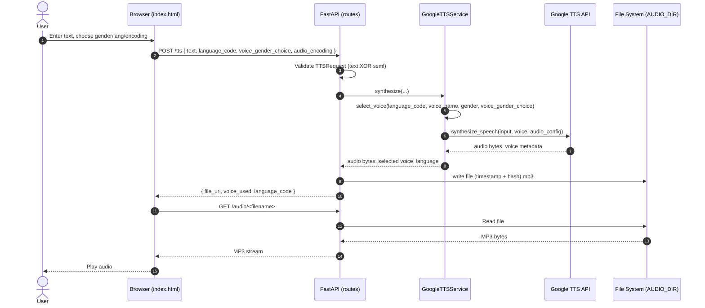

## TTS API — Architecture & Flow

This document explains the architecture, key components, and end-to-end processing flow of the TTS API service.

### Overview

- **Goal**: Provide a REST API over Google Cloud Text-to-Speech (TTS), save generated audio locally, and serve it via static hosting.
- **Tech**: FastAPI, Google Cloud Text-to-Speech, Uvicorn, Docker.
- **Primary audience**: Developers operating or extending the service.

### Key Components

- **Web App** (`app/main.py`)
  - Creates the FastAPI app, configures logging and CORS, mounts static files at `/audio` from `AUDIO_DIR`, and includes TTS routes.
- **Routes** (`app/api/routes_tts.py`)
  - `GET /health`: service health probe.
  - `GET /voices`: lists available Google TTS voices (filterable by `language_code`, `name_contains`).
  - `POST /tts`: synthesizes speech from `text` or `ssml`, writes audio to disk, returns a `file_url`.
  - `GET /`: serves `pages/index.html` for quick manual testing.
- **Models** (`app/models/schemas.py`)
  - `TTSRequest`: validates input; exactly one of `text` or `ssml` is required; supports `language_code`, `voice_name`, `gender`, `audio_encoding`, `speaking_rate`, `pitch`, `effects_profile_ids`, `voice_gender_choice`.
  - `TTSResponse`: contains `file_url`, `voice_used`, `language_code`.
- **TTS Service** (`app/services/gcp_tts.py`)
  - Wraps `google.cloud.texttospeech` for listing voices and synthesizing audio.
  - Voice selection supports explicit `voice_name`, preferred `gender`, fallbacks for Arabic locales, and a two-voice toggle via `voice_gender_choice` using `PREFERRED_VOICE_NAMES`.
- **Filename Utility** (`app/services/filename.py`)
  - Builds sanitized, timestamped, hashed audio filenames.
- **Middleware** (`app/middleware/error_handler.py`)
  - Catches unhandled exceptions and returns `500` with a generic JSON error.
- **Configuration** (`app/core/config.py`)
  - Provides `settings` from environment variables and `get_preferred_voice_list()`.
- **Logging** (`app/core/logging.py`)
  - Sets up structured logging to stdout; respects `LOG_LEVEL`.
- **Runner** (`run.py`)
  - Starts Uvicorn, with reload enabled by default when `RELOAD=true`.

### Configuration (env)

- `GOOGLE_APPLICATION_CREDENTIALS`: absolute path to the service account JSON (required to call Google TTS).
- `AUDIO_DIR`: directory to write audio files (defaults to `/data/audio`). Mounted as `/audio` in the app.
- `PREFERRED_VOICE_NAMES`: comma-separated list used for the male/female toggle.
- `CORS_ORIGINS`, `LOG_LEVEL`. Note: `API_KEY`, `RATE_LIMIT_ENABLED` exist but are not wired yet.

### Data & Static Files

- Audio files are written to `AUDIO_DIR` and served as static files under `/audio/<filename>`.
- Filenames include UTC timestamp and a short hash of the text to avoid collisions and aid cacheability.

### Error Handling

- Global middleware catches unhandled exceptions and returns a generic 500.
- Input validation is enforced by `TTSRequest` (mutual exclusivity for `text` vs `ssml`, bounds for rate/pitch).

### End-to-End Flow (Request → Response)



### Component View

```mermaid
flowchart LR
  subgraph Client
    B[Browser UI (index.html)]
  end

  subgraph Server[FastAPI App]
    R[Routes /health /voices /tts /]
    M[ErrorHandlerMiddleware]
    L[Logging]
    C[Settings (env)]
    S[GoogleTTSService]
    F[Filename Utility]
  end

  G[(Google Cloud TTS)]
  D[(AUDIO_DIR Storage)]

  B -->|HTTP| R
  R --> M
  R --> S
  R --> F
  S --> C
  R --> C
  L -.-> R
  S -->|RPC| G
  R -->|write/read| D
  B -->|GET /audio| R
```

### API Summary

- `GET /health`: service liveness.
- `GET /voices?language_code=&name_contains=`: list voices with optional filters.
- `POST /tts`: synthesize audio; response includes `file_url`.
- `GET /`: minimal UI for manual testing.

### Deployment

- Local: `uvicorn app.main:app --reload` (ensure `GOOGLE_APPLICATION_CREDENTIALS` and `AUDIO_DIR` are set).
- Docker: build with provided `Dockerfile`, run with volumes for `/data/audio` and credentials mounted (see `README.md`).

### Extensibility Notes

- Add API key or JWT auth via dependency in `routes_tts.py`.
- Wire rate limiting (SlowAPI) if needed.
- Extend UI to call `/voices` and offer selectable voice list.
